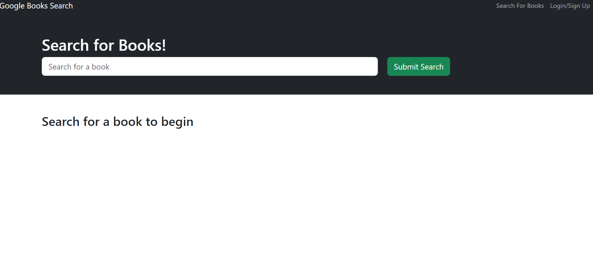
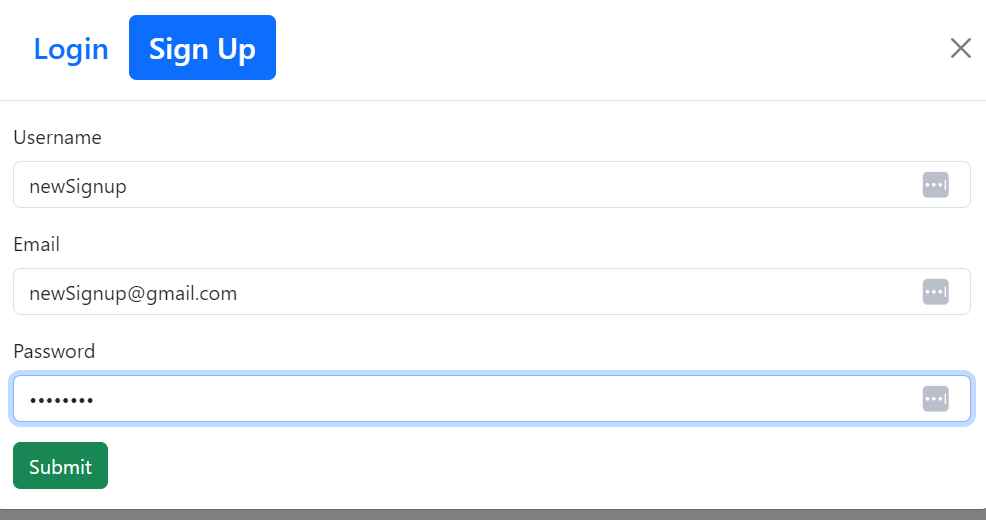
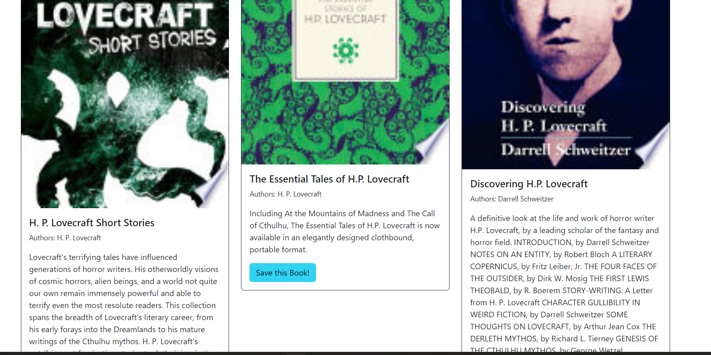
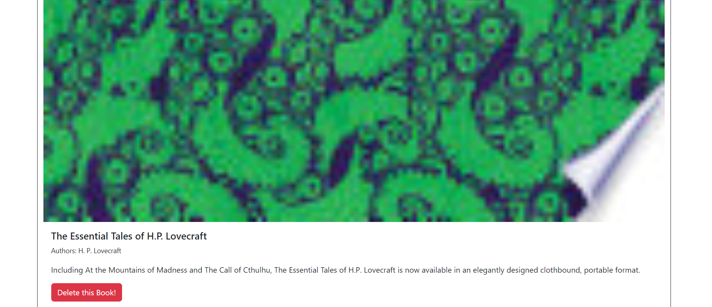

# Book Engine Search

## Description

This was an extremely fun challenge. The topic of which was to learn how to translate a working app's routing systems from a RESTful system, to one that uses GraphQL to fulfill it's needs. I learned alot in this challenge, and I appreciated the opportunity to get a really complete look at GraphQL's 'under the hood' functionality. 

## Table of Contents (Optional)

- [Installation](#installation)
- [Usage](#usage)
- [Credits](#credits)
- [License](#license)

## Installation

To install and run this program, please ensure all packages are correctly installed, using the "npm run install" command. You will then want to run the build command to create a "dist" folder, according to react standards. A develop command will run both client and server folders at once, allowing the front and backend to connect and run appropriately. 

## Usage

## Credits

Big thanks to TA George and tutor Charles Puente-Matos. 

## License

MIT License

Copyright (c) 2023 Kalani Jones

Permission is hereby granted, free of charge, to any person obtaining a copy
of this software and associated documentation files (the "Software"), to deal
in the Software without restriction, including without limitation the rights
to use, copy, modify, merge, publish, distribute, sublicense, and/or sell
copies of the Software, and to permit persons to whom the Software is
furnished to do so, subject to the following conditions:

The above copyright notice and this permission notice shall be included in all
copies or substantial portions of the Software.

THE SOFTWARE IS PROVIDED "AS IS", WITHOUT WARRANTY OF ANY KIND, EXPRESS OR
IMPLIED, INCLUDING BUT NOT LIMITED TO THE WARRANTIES OF MERCHANTABILITY,
FITNESS FOR A PARTICULAR PURPOSE AND NONINFRINGEMENT. IN NO EVENT SHALL THE
AUTHORS OR COPYRIGHT HOLDERS BE LIABLE FOR ANY CLAIM, DAMAGES OR OTHER
LIABILITY, WHETHER IN AN ACTION OF CONTRACT, TORT OR OTHERWISE, ARISING FROM,
OUT OF OR IN CONNECTION WITH THE SOFTWARE OR THE USE OR OTHER DEALINGS IN THE
SOFTWARE.

## How to Contribute
If you've like to contribute to this project, please reach out! I are incredibly proud of the work, and also of the numerous future opportunities for future features it could hold.

Before you reach out, please be familiar with the Contributor Covenant and the code of conduct within.

Link to GITHUB repo can be found here: https://github.com/kalaniJ94/Book-Search-Engine

## Tests

This application currently includes no tests.